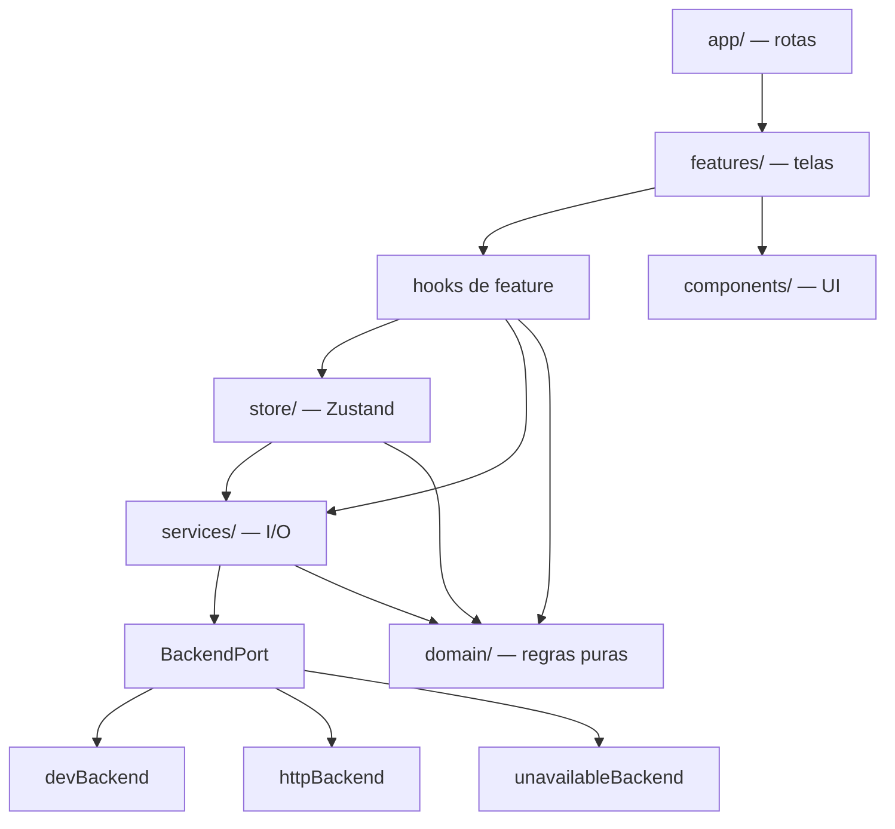

# Documentação técnica — budd

Aplicativo mobile de descoberta e consumo em bares, restaurantes e eventos.
React Native + Expo, TypeScript, roteamento por arquivos.

Este documento descreve **como o projeto está organizado e por quê**. Para
instalar e rodar, veja o [README](README.md).

---

## Sumário

1. [Visão geral](#1-visão-geral)
2. [Como executar](#2-como-executar)
3. [Bibliotecas e justificativas](#3-bibliotecas-e-justificativas)
4. [Estrutura de pastas](#4-estrutura-de-pastas)
5. [Arquitetura em camadas](#5-arquitetura-em-camadas)
6. [Navegação](#6-navegação)
7. [Design System](#7-design-system)
8. [Estado e persistência](#8-estado-e-persistência)
9. [Backend e camada de dados](#9-backend-e-camada-de-dados)
10. [Tratamento de erros](#10-tratamento-de-erros)
11. [Inicialização (bootstrap)](#11-inicialização-bootstrap)
12. [Configuração de ambiente](#12-configuração-de-ambiente)
13. [Testes](#13-testes)
14. [Decisões técnicas](#14-decisões-técnicas)
15. [Convenções de código](#15-convenções-de-código)
16. [Limitações conhecidas e melhorias futuras](#16-limitações-conhecidas-e-melhorias-futuras)

---

## 1. Visão geral

| | |
|---|---|
| **Plataforma** | Android e iOS via Expo; web parcial |
| **Linguagem** | TypeScript (strict), alias `@/*` → `./src/*` |
| **Roteamento** | `expo-router` (file-based) |
| **Estado** | Zustand v5 + middleware `persist` |
| **Estilo** | NativeWind v4 (Tailwind para React Native) |
| **Animação** | `react-native-reanimated` v4 (worklets na UI thread) |
| **Testes** | Jest + `jest-expo` + Testing Library — 32 suítes, 355 casos |

O app tem cinco abas inferiores, com **ROLÊ** ao centro como tela inicial:

```
LineUp  ·  Mapa  ·  [ ROLÊ ]  ·  Produtos  ·  Perfil
```

---

## 2. Como executar

```bash
npm install
cp .env.example .env     # ver seção 12
npx expo start -c
```

| Script | Efeito |
|---|---|
| `npm start` | Servidor de desenvolvimento |
| `npm run android` / `ios` | Abre no dispositivo/emulador |
| `npm test` | Suíte completa |
| `npm run test:watch` | Testes em modo watch |
| `npm run typecheck` | `tsc --noEmit` |
| `npm run lint` | ESLint via `expo lint` |
| `npm run doctor` | Diagnóstico de compatibilidade Expo |

> **Importante:** variáveis `EXPO_PUBLIC_*` são embutidas no bundle no arranque.
> Alterou o `.env`? Reinicie com `-c`; Fast Refresh não as recarrega.

---

## 3. Bibliotecas e justificativas

Cada dependência foi escolhida por manutenção ativa, compatibilidade com a
versão corrente do React Native e ausência de vulnerabilidades conhecidas.

### Núcleo

| Biblioteca | Versão | Por quê |
|---|---|---|
| `expo` | ~57.0.8 | SDK atual. Módulos nativos revisados e versionados em conjunto, o que elimina a classe de bug "biblioteca X não compila com RN Y". |
| `expo-router` | ~57.0.8 | Roteamento por arquivos. Grupos de rota `(private)`/`(public)` permitem aplicar a guarda de sessão no *layout*, cobrindo deep link, back stack e estado restaurado — não só a navegação manual. |
| `react-native` | 0.86.0 | Versão pareada ao SDK 57. |
| `typescript` | ~6.0.3 | Modo strict em todo o projeto. |

### Estado e dados

| Biblioteca | Versão | Por quê |
|---|---|---|
| `zustand` | ^5.0.14 | Sem Provider, sem boilerplate, e seletores granulares que evitam re-render em cascata. Escolhido no lugar de Redux Toolkit por peso e cerimônia desproporcionais ao escopo. |
| `@react-native-async-storage/async-storage` | 2.2.0 | Persistência de dados não sensíveis (carrinho, favoritos, preferências, avaliações). |
| `expo-secure-store` | ~57.0.1 | Persistência **do token de sessão**, usando Keystore (Android) e Keychain (iOS). Nunca gravamos token em AsyncStorage. |

### Interface

| Biblioteca | Versão | Por quê |
|---|---|---|
| `nativewind` | ^4.2.6 | Tailwind no React Native. Dá tokens de design consistentes por construção e mantém o estilo junto do markup, sem `StyleSheet.create` espalhado. |
| `react-native-reanimated` | 4.5.0 | Animação na UI thread via worklets. Necessário para o entalhe da tab bar, que recalcula o path SVG a cada frame — em JS isso engasgaria. |
| `react-native-svg` | 15.15.4 | Ícones e formas vetoriais próprias (tab bar, logo, loaders). |
| `react-native-gesture-handler` | ~2.32.0 | Gestos nativos; requisito do Reanimated e do `react-native-screens`. |
| `react-native-safe-area-context` | ~5.7.0 | Insets corretos em notch e barra de gestos. |
| `react-native-screens` | ~4.26.0 | Telas nativas — reduz consumo de memória em pilhas profundas. |
| `expo-linear-gradient` | ~57.0.1 | Gradientes sobre imagens de capa, para legibilidade do texto. |

### Recursos

| Biblioteca | Versão | Por quê |
|---|---|---|
| `react-native-maps` | 1.27.2 | Mapa. Usa `PROVIDER_DEFAULT`: Apple Maps no iOS, Google no Android — evita exigir chave em ambas as plataformas. |
| `expo-location` | ~57.0.6 | Localização do usuário, com permissão solicitada em contexto. |
| `react-native-qrcode-svg` | ^6.3.21 | QR Code do PIX. Renderiza em SVG, sem dependência nativa extra. |
| `expo-clipboard` | ~57.0.1 | Copiar código PIX. |
| `expo-linking` | ~57.0.4 | Deep links e abertura de apps externos (mapas, WhatsApp). |
| `expo-splash-screen` | ~57.0.5 | Controla o momento de ocultar a splash nativa — o app só entrega a tela quando o bootstrap termina. |
| `expo-dev-client` | ~57.0.9 | Development build, necessário para módulos nativos fora do Expo Go. |

### Nota de segurança

O `package.json` fixa um override:

```json
"overrides": { "uuid": "^11.1.1" }
```

Versões antigas de `uuid` chegavam por dependência transitiva. O override força
uma linha sem vulnerabilidade conhecida.

---

## 4. Estrutura de pastas

```
├── app/                    Rotas (expo-router) — apenas composição
│   ├── _layout.tsx         Layout raiz: providers, fontes, status bar
│   ├── index.tsx           Splash / bootstrap, decide o destino
│   ├── (public)/           Rotas sem sessão
│   │   ├── _layout.tsx     Guarda: autenticado → sai daqui
│   │   └── login.tsx
│   └── (private)/          Rotas com sessão
│       ├── _layout.tsx     Guarda: não autenticado → /login
│       ├── (tabs)/         As cinco abas
│       ├── (account)/      Sub-telas do perfil
│       ├── bar/[id].tsx
│       ├── event/[id].tsx
│       └── order/[id].tsx
│
└── src/
    ├── domain/             Regras puras, sem I/O e sem React
    ├── services/           I/O: rede, storage, localização, links
    ├── store/              Estado global (Zustand)
    ├── features/           Telas e componentes por domínio
    ├── components/         UI reutilizável, agnóstica de domínio
    ├── hooks/              Hooks genéricos
    ├── theme/              Tokens de design
    ├── config/             Ambiente e validação
    ├── bootstrap/          Inicialização
    ├── constants/          Chaves de storage, constantes de negócio
    ├── mocks/              Conteúdo estático (catálogo, bares, eventos)
    ├── types/              Tipos compartilhados
    └── utils/              Funções auxiliares (dinheiro, datas, cn)
```

### Peso relativo

| Área | Arquivos | Papel |
|---|---:|---|
| `features/` | 83 | Onde vive o produto |
| `components/` | 41 | Design System |
| `services/` | 26 | Fronteira de I/O |
| `domain/` | 19 | Regras testáveis |
| `store/` | 12 | Estado |

**A regra que organiza tudo:** `app/` só compõe, nunca implementa. Cada arquivo
de rota importa uma tela de `features/` e a renderiza. Isso mantém a navegação
substituível e as telas testáveis fora do roteador.

---

## 5. Arquitetura em camadas



### Direção das dependências

O fluxo é de cima para baixo, sem exceção:

- **`domain/`** não importa nada do app. Sem React, sem rede, sem storage. São
  funções puras — validação de pedido, filtros de cardápio, tipos de pagamento,
  aritmética de carteira. É a camada mais barata de testar e a que mais garante.
- **`services/`** é a única camada que faz I/O. Nenhuma tela chama `fetch`,
  nenhuma tela lê storage.
- **`store/`** guarda estado e orquestra serviços. Não conhece componentes.
- **`features/`** consome store e serviços através de hooks próprios.
- **`components/`** não conhece domínio algum. Um `Button` não sabe o que é um bar.

Quebrar essa direção é o único erro de arquitetura que o projeto trata como
inaceitável — é o que mantém o domínio testável sem simular o mundo.

### Anatomia de uma feature

```
features/<nome>/
├── screens/      Telas completas
├── components/   Componentes daquele domínio
├── hooks/        Lógica de tela (estado local, orquestração)
├── services/     I/O específico (quando existe)
├── store/        Estado local da feature (quando existe)
└── index.ts      API pública da feature
```

Features não importam umas das outras por caminho profundo — apenas pelo
`index.ts`. O que não está exportado ali é privado.

---

## 6. Navegação

### Grupos de rota e a guarda de sessão

A proteção fica no **layout do grupo**, não em telas individuais:

```tsx
// app/(private)/_layout.tsx
const status = useSessionStore((state) => state.status);

if (status === 'checking') return <LoadingState />;
if (status !== 'authenticated') return <Redirect href="/login" />;
return <Stack />;
```

Isso importa: um layout cobre **toda** entrada no grupo — deep link, URL
digitada, estado de navegação restaurado, notificação, botão voltar. Redirecionar
só a partir de `app/index` deixaria todos esses caminhos abertos.

O estado `checking` é um terceiro estado deliberado. Sem ele, o app renderizaria
conteúdo privado por um frame antes de descobrir que não há sessão.

### Tab bar customizada

Usa `expo-router/ui` (tabs headless) em vez do tab navigator padrão, porque o
desenho pede um entalhe côncavo que desliza sob a aba ativa — impossível de
expressar pelas opções do componente padrão.

O path do SVG é recalculado **em worklet, na UI thread**
([TabBar.tsx](src/components/navigation/TabBar.tsx)), a cada frame da transição.
Em JS haveria queda de frames na animação.

---

## 7. Design System

### Tokens

Fonte única em [`src/theme/palette.js`](src/theme/palette.js), em CommonJS para
que o `tailwind.config.js` possa fazer `require()`. O re-export tipado em
[`colors.ts`](src/theme/colors.ts) serve o código que precisa de string crua —
`fill` de SVG, marcadores de mapa, opções nativas de navegação.

Alterar um valor no palette atualiza classe Tailwind e token JS ao mesmo tempo.

| Grupo | Tokens |
|---|---|
| Superfícies | `bg` `surface` `surface-alt` `surface-raised` `surface-muted` `surface-nav` `surface-sheet` |
| Verde da marca | `primary` `primary-tint` `primary-border` `primary-surface` |
| Chama (loaders) | `flame` `flame-light` `flame-dark` |
| Bordas | `border` `border-subtle` `border-muted` `border-green` |
| Texto | `text` `text-softer` `text-soft` `text-muted` `text-dim` `text-faint` `text-ghost` |
| Estado | `danger` `danger-alt` `danger-solid` `danger-border` |

Sete níveis de texto e sete de superfície é o que permite hierarquia visual em
tema escuro sem recorrer a opacidade arbitrária.

Outros arquivos de tema: `typography.ts`, `spacing.ts`, `radius.ts`,
`shadows.ts`, `gradients.ts`, `animation.ts` (durações e curvas).

**Uso:** prefira classes Tailwind (`className="bg-primary"`) no JSX; use os
tokens de `colors` apenas onde a API exige string.

### Componentes

| Camada | Componentes |
|---|---|
| **`ui/`** | `Avatar` `Badge` `Button` `Card` `Chip` `Divider` `GradientImage` `IconButton` `Skeleton` `StarRating` `Stepper` `Toggle` `Touchable` `Typography` + `icons/` |
| **`feedback/`** | `ConfirmDialog` `EmptyState` `ErrorState` `FlameLoader` `LoadingState` `MapLoader` `Toast` |
| **`layout/`** | `Screen` `ScreenHeader` `Section` |
| **`navigation/`** | `TabBar` `TabBarButton` `BackButton` |

`Screen` centraliza safe area, fundo e o respiro inferior que a tab bar flutuante
exige (`TAB_BAR_CONTENT_INSET`) — nenhuma tela recalcula isso.

### Acessibilidade

Aplicada nos componentes, não como revisão posterior: `accessibilityRole`,
`accessibilityLabel`, `accessibilityLiveRegion` em mensagens de erro,
`accessibilityViewIsModal` em sheets, e `useModalAccessibility` para mover o foco
do leitor de tela ao abrir um modal.

---

## 8. Estado e persistência

| Store | Persistido em | Conteúdo |
|---|---|---|
| `sessionStore` | SecureStore | Token, usuário, status de autenticação |
| `cartStore` | AsyncStorage | Itens, estabelecimento, troca pendente |
| `favoritesStore` | AsyncStorage | IDs de bares favoritos |
| `preferencesStore` | AsyncStorage | Interesses, notificações, permissões |
| `reviewsStore` | AsyncStorage | Avaliações locais e rascunhos |
| `walletStore` | — (memória) | Saldo; a fonte de verdade é o servidor |
| `toastStore` | — (memória) | Mensagem efêmera |

### Chaves

Centralizadas em [`constants/storage.ts`](src/constants/storage.ts), para que um
rename não órfã dados gravados.

```ts
cart:        'budd:cart'
favorites:   'budd:favorites'
preferences: 'budd:preferences'
reviews:     'budd:reviews'
session:     'budd.session'   // ponto, não dois-pontos
```

> A chave da sessão usa `.` porque o `expo-secure-store` aceita **apenas**
> alfanuméricos, `.`, `-` e `_`. Um `:` faz toda chamada ao keystore lançar em
> runtime — e como o erro é capturado, o sintoma é o app simplesmente nunca
> restaurar a sessão. O mock de teste em `jest.setup.js` valida a mesma regra,
> para que isso não passe pela suíte de novo.

### Versionamento e migração

Cada store persistido declara `version`, `partialize` e `migrate`. Dados de uma
versão anterior ou corrompidos são **descartados**, não parcialmente aceitos:

```ts
migrate: (persisted, version) =>
  version >= VERSION && isValid(persisted) ? persisted : ESTADO_INICIAL
```

Um JSON meio escrito não deve derrubar o app no boot.

### Seletores

Seletores devem devolver **referência estável**. Um seletor que faz `.filter()`
ou `.map()` cria um array novo a cada leitura; como o Zustand v5 lê via
`useSyncExternalStore`, referência nova é interpretada como "a store mudou" e o
componente entra em loop infinito de render.

Quando o seletor precisa derivar uma coleção, envolva em `useShallow`:

```tsx
const reviews = useReviewsStore(
  useShallow((state) => selectVisibleReviewsForVenue(state, bar.id)),
);
```

---

## 9. Backend e camada de dados

### A porta

Toda operação que dependeria de servidor passa por uma interface única,
`BackendPort` ([backendTypes.ts](src/services/backend/backendTypes.ts)), com três
implementações:

| Implementação | Quando | Comportamento |
|---|---|---|
| `devBackend` | `EXPO_PUBLIC_ENABLE_DEV_BACKEND=true` **e** `__DEV__` | Servidor em memória |
| `httpBackend` | Há `EXPO_PUBLIC_API_URL` válida | Requisições reais |
| `unavailableBackend` | Nenhum dos anteriores | Recusa explícita |

```ts
export function resolveBackendMode(): BackendMode {
  if (environment.enableMocks) return 'dev';
  if (environment.apiBaseUrl) return 'http';
  return 'unavailable';
}
```

`unavailable` é um resultado de primeira classe, não um erro: sem servidor, as
telas dizem isso com clareza em vez de falhar de forma estranha. **Não existe
caminho em que a falta de backend vire um sucesso falso.**

### O backend de desenvolvimento

`devBackend` é um servidor em memória, não um "caminho feliz". Ele reproduz as
garantias que importam:

- **Idempotência** — repetir uma chamada com a mesma chave devolve o registro
  original, sem criar um segundo.
- **Preços vêm do catálogo**, nunca do request. Um valor enviado pelo cliente não
  pode definir o que será cobrado.
- **`pending` ≠ `paid`** — uma cobrança nasce pendente e **nada a confirma
  sozinho**. Não há timer. Em demonstração, um controle explícito
  (`devBackendControls.confirmPixPayment`) faz o papel do webhook do provedor
  PIX, e o app percorre o mesmo caminho de polling que usaria de verdade.
- **Crédito uma única vez** — um `settledCharges` impede que uma confirmação
  repetida credite duas vezes.

Conta semeada: `user@budd.com` / `123456`, exportada como `DEV_CREDENTIALS` —
definida em um único lugar e consumida pela tela de login e pelos testes.

---

## 10. Tratamento de erros

Uma única forma de erro para todo o app: `AppError`
([errors.ts](src/services/errors.ts)), com **duas mensagens separadas**.

```ts
class AppError extends Error {
  code: AppErrorCode;
  userMessage: string;  // seguro para renderizar
  detail?: string;      // técnico, nunca chega à tela
  status?: number;
}
```

Essa separação é o que mantém `"TypeError: Network request failed"` fora da
interface sem jogar fora a informação necessária para depurar.

Códigos: `validation` · `unauthenticated` · `forbidden` · `network` · `timeout` ·
`conflict` · `unavailable` · `out_of_stock` · `not_found` · `payment_declined` ·
`charge_expired` · `unknown`

Cada um tem mensagem padrão em português. `normalizeError()` converte qualquer
coisa lançada em um `AppError`; `reportError()` registra com escopo.

---

## 11. Inicialização (bootstrap)

[`bootstrap.ts`](src/bootstrap/bootstrap.ts) divide o arranque em duas
categorias, e a distinção é o desenho inteiro:

**Bloqueante** — sem isso o app não roteia corretamente:
- validação de ambiente (config inválida não se conserta em runtime)
- restauração de sessão (o roteamento depende dela; navegar antes piscaria login)
- hidratação de carrinho, favoritos e preferências

**Não bloqueante** — registrado, nunca fatal:
- healthcheck do backend (servidor fora do ar não é falha de inicialização)

Detalhes:

- **Teto de 10 s** (`BOOTSTRAP_TIMEOUT_MS`) como guarda contra tarefa travada.
- **Piso de 800 ms** (`MINIMUM_SPLASH_DURATION_MS`), puramente visual, para
  evitar um flash quando a hidratação resolve em 50 ms. Só pode *atrasar* a
  entrega, nunca antecipá-la.
- **Trava de execução única**: duas montagens simultâneas compartilham a mesma
  promise, produzindo um único arranque.

---

## 12. Configuração de ambiente

Copie `.env.example` para `.env`. Apenas variáveis `EXPO_PUBLIC_*` chegam ao
runtime — e **tudo isso é embutido no bundle**, então nunca guarde segredo aqui.

| Variável | Efeito |
|---|---|
| `EXPO_PUBLIC_APP_ENV` | `development` \| `staging` \| `production` |
| `EXPO_PUBLIC_API_URL` | Base da API. **Sem fallback** — ausente fica `null` e é reportado |
| `EXPO_PUBLIC_API_TIMEOUT` | Timeout em ms (padrão 15000) |
| `EXPO_PUBLIC_ENABLE_DEV_BACKEND` | `true` liga o backend em memória (só em `__DEV__`) |
| `EXPO_PUBLIC_WHATSAPP_SUPPORT_NUMBER` | Suporte; inválido desabilita a entrada do menu |

Duas decisões explícitas:

1. **Não há host de fallback.** Substituir por um placeholder tornava um build
   mal configurado indistinguível de um funcional.
2. **O ambiente é explícito, não inferido de `__DEV__`.** Um build de staging não
   deve ser tratado como produção. Quando a variável falta, um bundle de
   desenvolvimento é `development` e qualquer outro é tratado como `production` —
   falhando na direção da regra mais estrita.

`validateEnvironment()` devolve um resultado em vez de lançar, para que o
bootstrap possa renderizar uma tela de erro com retry. Lançar em escopo de módulo
produzia crash em branco.

---

## 13. Testes

**32 suítes, 355 casos.** `jest-expo` fornece transform, mapeamento e ambiente RN.

```bash
npm test              # tudo
npm run test:watch    # watch
```

Convenção: testes em `__tests__/` ao lado do código.

### O que é coberto

| Área | Foco |
|---|---|
| `domain/` | Regras puras — validação, filtros, aritmética de dinheiro |
| `store/` | Sessão, carrinho, persistência, exclusão de conta |
| `services/backend/` | Fluxos críticos: idempotência, pagamento, estoque |
| `config/` | Validação de ambiente |
| `app/` | Guarda de rota nos três estados |
| `features/` | Checkout, mapa, avaliações |

### Mocks nativos

Em [`jest.setup.js`](jest.setup.js). Cada mock espelha o contrato real perto o
bastante para o código exercitar seus ramos de verdade — o SecureStore falso
**realmente armazena** e **valida o formato da chave**, de modo que a restauração
de sessão é testada, não apenas simulada.

Mocks de componente ficam em `__mocks__/`, não no setup: o preset Babel do
NativeWind injeta um binding de escopo de módulo em cada arquivo, e as factories
de `jest.mock` são içadas acima dele.

---

## 14. Decisões técnicas

**Zustand em vez de Redux Toolkit.** Sem Provider, sem action creators, sem
reducers. Seletores granulares evitam re-render em cascata. RTK traria cerimônia
desproporcional ao escopo.

**NativeWind em vez de styled-components.** Tokens de design consistentes por
construção, estilo junto do markup, e compilação para `StyleSheet` — sem custo de
runtime de tema.

**Reanimated worklets em vez de `Animated` da RN.** Animações rodam na UI thread.
Para o entalhe da tab bar, que recalcula um path SVG por frame, é a diferença
entre fluido e engasgado.

**Tabs headless em vez do tab navigator padrão.** O desenho exige um entalhe
côncavo deslizante, inexprimível pelas opções do componente padrão.

**Guarda no layout, não na tela.** Cobre toda entrada no grupo de rotas.

**Interface `BackendPort` com três implementações.** Permite desenvolver o front
inteiro sem servidor, mantendo o contrato honesto: `unavailable` é um estado
explícito, e nenhum caminho transforma ausência de backend em sucesso simulado.

**Domínio puro isolado.** `domain/` não importa React nem I/O. É a camada mais
barata de testar e a que mais garante.

**Dinheiro em centavos inteiros.** `MoneyInCents` como tipo, com `sumCents` e
`multiplyCents`. Ponto flutuante não descreve dinheiro.

**Duas mensagens em cada erro.** `userMessage` e `detail` nunca se misturam.

---

## 15. Convenções de código

- **Imports** ordenados: externos → `@/` → relativos. `expo lint` verifica.
- **Alias `@/`** para tudo em `src/`; relativos apenas dentro da mesma feature.
- **Barrels (`index.ts`)** definem a API pública de cada pasta. Não alcance o
  interior de uma feature por caminho profundo.
- **Comentários explicam *por quê*, não *o quê*.** Um comentário que descreve o
  que a linha faz é ruído; um que registra a razão de uma escolha não óbvia — ou
  o bug que ela evita — é o que se quer preservar.
- **Português** em texto de interface; **inglês** em identificadores e comentários.
- **`__DEV__`** protege todo recurso de desenvolvimento, além da variável de ambiente.

---

## 16. Limitações conhecidas e melhorias futuras

Registrado com honestidade — o que falta é tão informativo quanto o que existe.

### Divergência de identidade visual

O briefing define **`#76EB3C`** como Verde Principal. No palette atual esse valor
está em `flame` (usado nos loaders), enquanto `primary` é `#33D13A`. São verdes
próximos, mas **não é a cor especificada**. Corrigir é trocar um valor em
[`palette.js`](src/theme/palette.js), com impacto visual em todo o app — por isso
está registrado como decisão pendente, não alterado em silêncio.

### Telas ausentes

| Tela | Situação |
|---|---|
| Splash animada | Existe apenas o PNG estático do `expo-splash-screen` |
| Detalhes do Produto | Há cards (`ProductGridCard`, `ProductListRow`), não há tela |
| Assistente Inteligente | Não iniciado |
| Filtros na Home | `RoleTabs` alterna bares/eventos; faltam chips de categoria |

### Técnicas

- **Sem backend real.** `httpBackend` está implementado contra a `BackendPort`,
  mas nunca foi exercitado contra um servidor.
- **`devBackend` é volátil.** Estado em memória de módulo: um reload completo
  zera pedidos, ingressos, carteira e avaliações. A sessão sobrevive (SecureStore).
- **Sem cadastro.** Não há `signUp` na `BackendPort` nem tela correspondente.
- **Sem cobertura de teste em componentes visuais.** A suíte cobre domínio, store
  e serviços; telas têm cobertura pontual.
- **Sem i18n.** Textos em português direto no JSX.
- **Web parcial.** Sem keystore no navegador, a sessão fica só em memória e se
  perde ao recarregar — perda deliberada de conveniência, não de sigilo: gravar
  token em `localStorage` seria uma degradação silenciosa de segurança.
